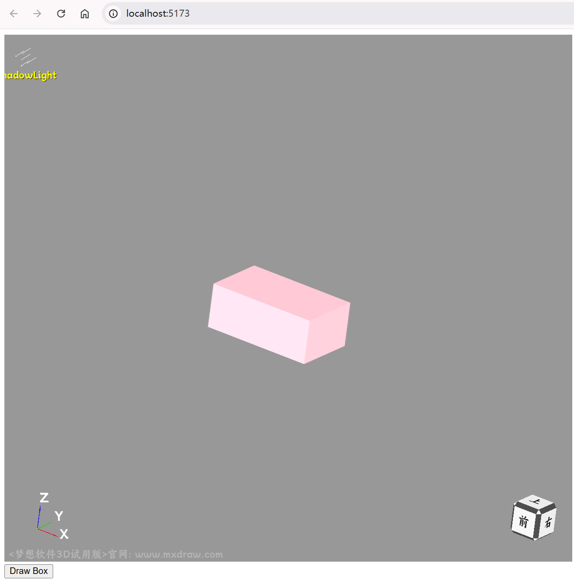

# Quick Start

> Contact Information: 710714273@qq.com


Official Website: <https://www.webcadsdk.com/>

## Installation

```sh
npm init -y
npm install vite -D
npm install mxcad3d
```

## Add index.html

```html
<!DOCTYPE html>
<html lang="en">
<head>
    <meta charset="UTF-8">
    <meta http-equiv="X-UA-Compatible" content="IE=edge">
    <meta name="viewport" content="width=device-width, initial-scale=1.0">
    <title>vite use mxcad</title>
</head>
<body>
    <div style="height: 800px; overflow: hidden;"> <canvas id="myCanvas"></canvas></div>
    <button id="drawBox">Draw Box</button>
    <script type="module" src="./src/index.ts"></script>
</body>
</html>
```
## Add tsconfig.json

```json
{
  "compilerOptions": {
    "module": "esnext",
    "moduleResolution": "node",
    "typeRoots": ["./node_modules/@types", "./typings"]
  }
}
```
## Add src/index.ts

```ts
import { MdGe, Mx3dGeColor, Mx3dGeMaterial, Mx3dMkBox, MxCAD3DObject } from "mxcad3d"

// Create MxCAD3D object
const mxcad3d = new MxCAD3DObject()

// Initialize MxCAD3D object
mxcad3d.create({
    // CSS selector string for the canvas element (ID selector in the example) or the canvas element object itself
    canvas: "#myCanvas",
    // Get the path to load the WASM file
    locateFile: (fileName) => new URL(`/node_modules/mxcad3d/dist/wasm/3d/${fileName}`, import.meta.url).href,
})

// After initialization is completed
mxcad3d.on("init", () => {
    console.log("Initialization completed");
});

function drawBox() {
    const doc = mxcad3d.getDocument();
    // Prepare shape label
    const boxLabel = doc.addShapeLabel();
    // Prepare color
    const redColor = new Mx3dGeColor(MdGe.MxNameOfColor.Color_NOC_PINK);
    // Prepare material
    const material = new Mx3dGeMaterial(MdGe.MxNameOfMaterial.Material_NOM_Gold);
    material.SetMaterialType(MdGe.MxTypeOfMaterial.Material_TOM_PHYSIC);
    // Generate cube shape
    const boxMaker = new Mx3dMkBox(50, 30, 20);
    const boxShape = boxMaker.Shape();
    // Add shape and color to the document
    boxLabel.setShape(boxShape);
    boxLabel.setColor(redColor);
    boxLabel.setMaterial(material);
    // Update view
    mxcad3d.update();
}

document.getElementById("drawBox").addEventListener("click", drawBox);
```

## Run

```sh
npx vite
```

## Click "Draw Box"

