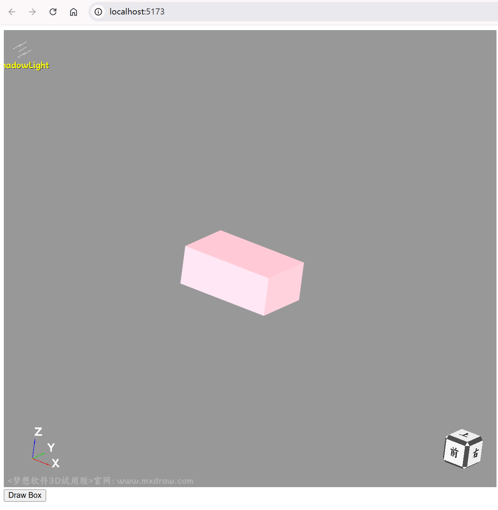

# 快速入门

> 联系方式: 710714273@qq.com


官网地址: <https://www.webcadsdk.com/>

## 安装

```sh
npm init -y
npm install vite -D
npm install mxcad3d
```

## 添加 index.html

```html
<!DOCTYPE html>
<html lang="en">
<head>
    <meta charset="UTF-8">
    <meta http-equiv="X-UA-Compatible" content="IE=edge">
    <meta name="viewport" content="width=device-width, initial-scale=1.0">
    <title>vite use mxcad</title>
</head>
<body>
    <div style="height: 800px; overflow: hidden;"> <canvas id="myCanvas"></canvas></div>
    <button id="drawBox">Draw Box</button>
    <script type="module" src="./src/index.ts"></script>
</body>
</html>
```
## 添加 tsconfig.json

```json
{
  "compilerOptions": {
    "module": "esnext",
    "moduleResolution": "node",
    "typeRoots": ["./node_modules/@types", "./typings"]
  }
}
```
## 添加 src/index.ts

```ts
import { MdGe, Mx3dGeColor, Mx3dGeMaterial, Mx3dMkBox, MxCAD3DObject } from "mxcad3d"

// 创建mxcad3d对象
const mxcad3d = new MxCAD3DObject()

// 初始化mxcad3d对象
mxcad3d.create({
    // canvas元素的css选择器字符串（示例中是id选择器），或canvas元素对象
    canvas: "#myCanvas",
    // 获取加载wasm路径位置
    locateFile: (fileName) => new URL(`/node_modules/mxcad3d/dist/wasm/3d/${fileName}`, import.meta.url).href,
})

// 初始化完成
mxcad3d.on("init", () => {
    console.log("初始化完成");
});

function drawBox() {
    const doc = mxcad3d.getDocument();
    // 准备标签
    const boxLabel = doc.addShapeLabel();
    // 准备颜色
    const redColor = new Mx3dGeColor(MdGe.MxNameOfColor.Color_NOC_PINK);
    // 准备材质
    const material = new Mx3dGeMaterial(MdGe.MxNameOfMaterial.Material_NOM_Gold);
    material.SetMaterialType(MdGe.MxTypeOfMaterial.Material_TOM_PHYSIC);
    // 生成立方体形状
    const boxMaker = new Mx3dMkBox(50, 30, 20);
    const boxShape = boxMaker.Shape();
    // 形状以及颜色添加至文档
    boxLabel.setShape(boxShape);
    boxLabel.setColor(redColor);
    boxLabel.setMaterial(material);
    // 更新视图
    mxcad3d.update();
}

document.getElementById("drawBox").addEventListener("click", drawBox);
```

## 运行

```sh
npx vite
```

## 点击 Draw Box

